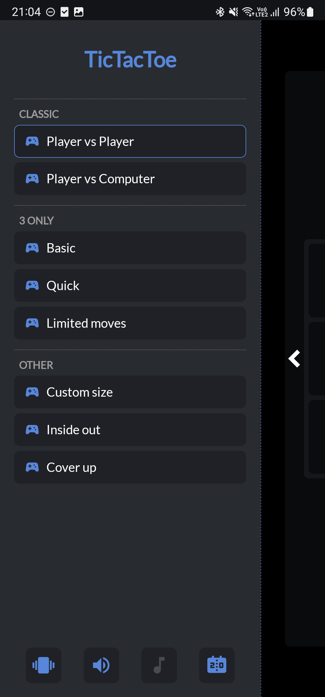
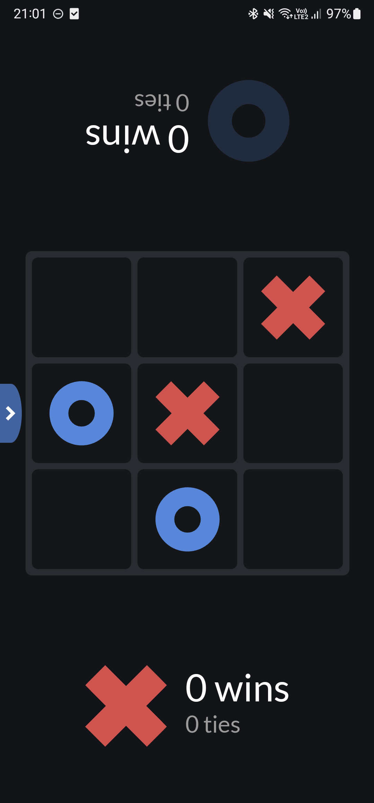
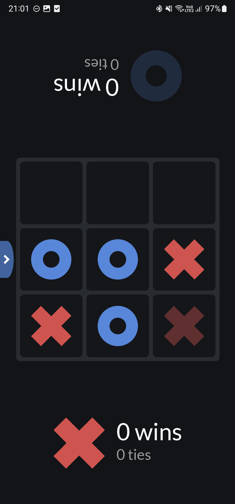
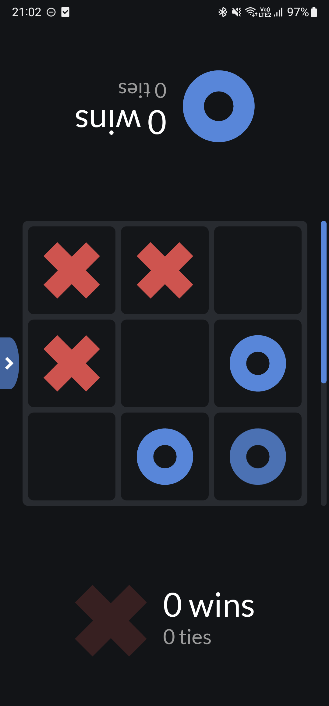
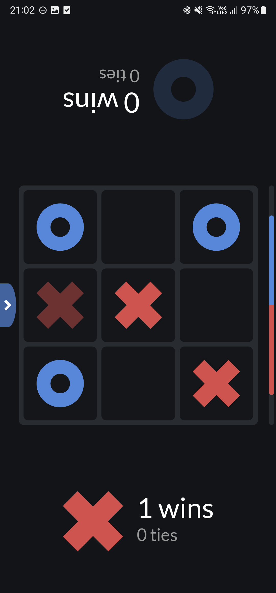
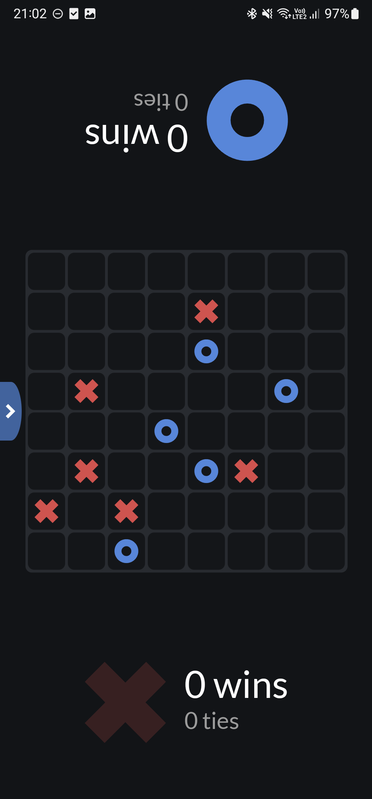
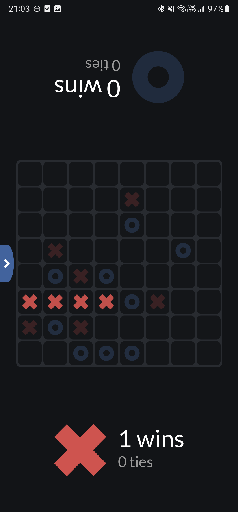
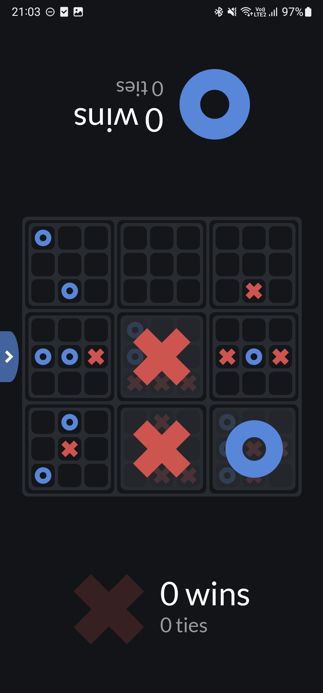
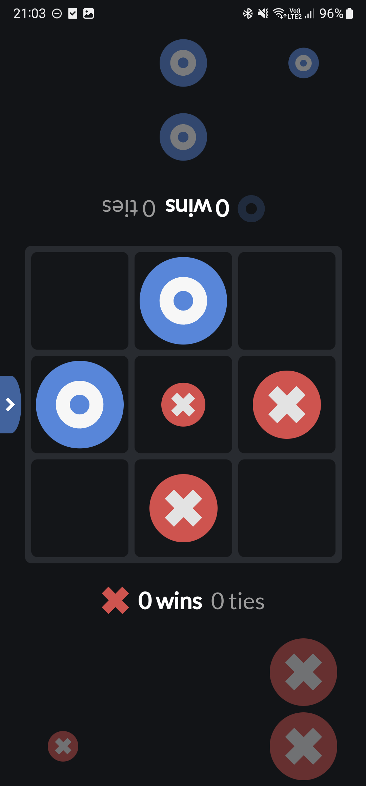

# TicTacToe

Online game with multiple styles of tic tac toe (TicTacToe / pt-BR: Jogo da velha).
You can play the game using <a href="https://hms-douglas.github.io/tictactoe/">this link</a> 😄!
 

 
<h1>Game modes and rules:</h1>
<h2>Classic - Player vs Player | Player vs Computer</h2>
 

<h2>3 only</h2>
- Tic tac toe based on the bolt game. After you add 3 Xs or Os the first X or O will be removed when adding the 4th...
 

<h3>3 only - Quick</h3>
- The same rules for the basic game... However in this game each player has 1.5 seconds to make a move, in case the player does not make a move the game will do a random move for the player...
 

<h3>3 only - Limited moves</h3>
- The same rules for the basic game... However in this mode for each "game" there will be a limited amount of moves (from 9 to 30, random)... in case the amount is reached the game will end in tie...
 

<h3>Other</h3>
Other game modes, they are:

<h2>Custom size</h2>
- The player can set any size for the board (minimum size is 4)... The same rules from the basic game goes for this game, however the player need 4 Xs or Os to win, while in the basic game is only required 3.
 

<h2>Inside out</h2>
- There are 10 games. One outter game and 9 inner. To win a square in the outter game the players need to win the correspondent inner game of that square... In the inner games there are no tie, in case a tie is reached the correspondent inner board will be cleared and the players can try again...
 

<h2>Cover up</h2>
- Each player has 6 pieces of different sizes. Larger pieces can be placed on top of smaller ones.
 

 
<h2>Donations</h2>

If you would like to support me, you can make a donation using <a href="https://www.paypal.com/donate/?hosted_button_id=JT8L3MX5MF74C">this link</a>

 
<h2>Log</h2>
<b>v1.0.0</b>
<ul>
  <li>Release.</li>
</ul>
